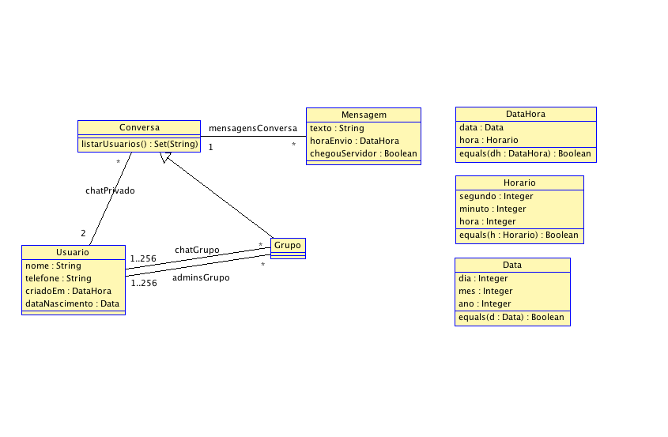

# Exercício

Abaixo seguem os diagramas de classe e invariantes necessários para o exercício. Ao fim, deve ser enviado para [meu email](mailto:julio.costa@ccc.ufcg.edu.br) um conjunto de arquivos `.use`, onde cada um cria um dos diagramas e invariantes aqui explicados. (Um arquivo para o diagrama e invariantes em `Diagrama 1`, outro para `Diagrama 2`, e assim por diante). As dúvidas sobre o exercício podem ser esclarecidas através do mesmo email da submissão ou através do Slack.

A deadline da atividade será especificada pela professora.

**Atenção**:

1. A atividade é **INDIVIDUAL**, e quaisquer indícios de que uma ou mais questões foram copiadas de outro(s) colega(s) fará com que recebam nota **ZERO**.

2. Os arquivos **DEVEM** estar compilando, caso contrário o aluno receberá nota **ZERO** no diagrama que não compilou, independente da corretude das constraints.

## Diagrama 1

Considerando o diagrama acima, implemente-o usando USE, como instruído nos exemplos do README. Em seguida, especifique as questões:

1. O Horario deve ter segundos e minutos entre 0 e 59, e horas entre 0 e 23 (inclusos).

2. A data deve ter dias entre 0 e 31, meses entre 1 e 12, e ano sendo o atual ou algum ano anterior, mas não anterior à 2000 (inclusos).

3. Para uma dada conversa, os membros da conversa são diferentes entre si.

4. Para um dado grupo, nenhum membro está repetido.

5. Nenhuma mensagem deve ter seu texto vazio.

6. Cada grupo deve ter pelo menos 1 administrador, e este administrador deve ser um de seus membros.

7. Um grupo não pode ter mais administradores que membros.

8. Especifique que a função `listarUsuarios()` de uma Conversa retorna os nomes dos usuários.

Já que não é possível utilizar o `def`, modifique o diagrama para incluir a assinatura de função `mensagensEnviadas`, e especifique que deve retornar todas as mensagens enviadas pelo usuário.

## Diagrama 2

Considerando o diagrama acima, implemente-o usando USE, como instruído nos exemplos do README. Em seguida, especifique as questões:

1. Um artista não pode ter dois albums com nomes iguais.

2. Dois discos de um mesmo album não podem ter números iguais

3. Um EP deve conter de três a seis músicas.

4. Um Single deve conter de uma a três músicas.

5. Um album deve conter ao menos 8 musicas.

6. A duração de uma música não pode ser negativo ou zero.

7. A duração de uma Playlist/EP/Disco/Single é igual à soma do tempo de cada uma de suas músicas.

8. A duração de um Album é a soma do tempo de cada um de seus discos.

9. O total de Visualizações de um Album/Single/EP é o total de visualizações de suas músicas.

10. Uma Playlist Colaborativa não pode ser pública, e vice-versa.

11. Especifique que após ouvir uma música, a quantidade de suas visualizações aumentou em 1.
