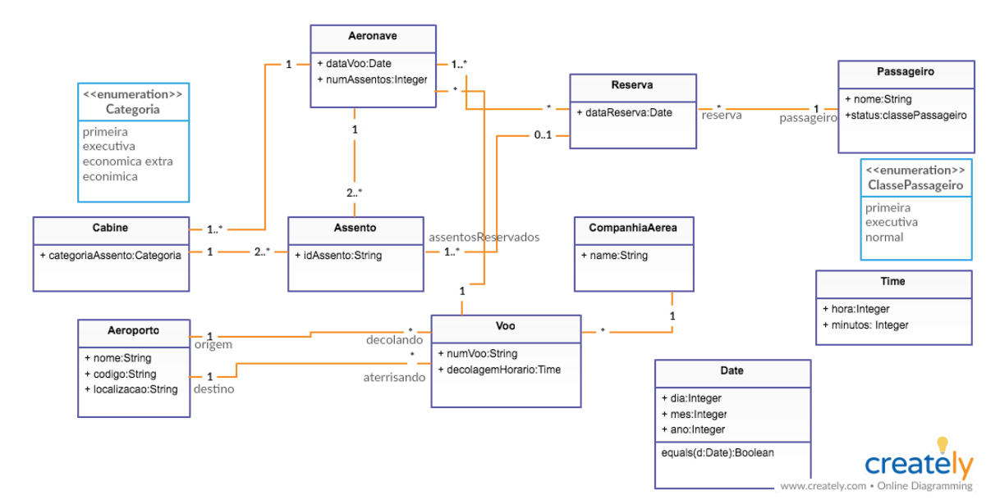
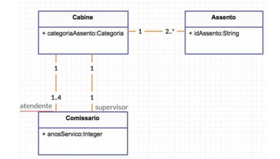
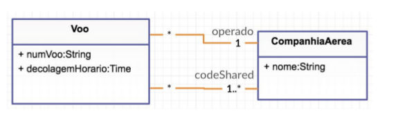
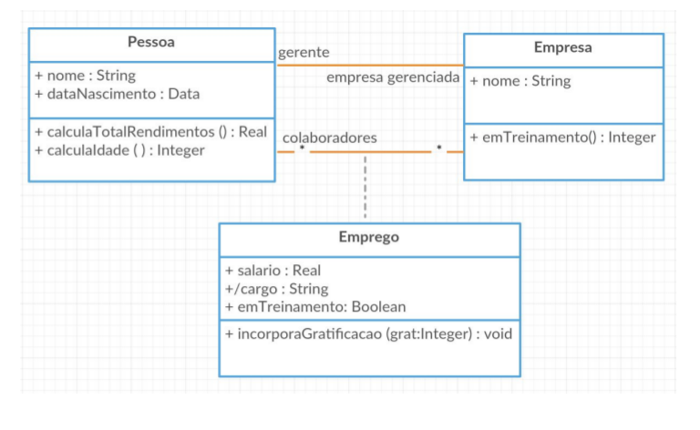

# Exercício

Abaixo seguem os diagramas de classe e invariantes necessários para o exercício. Ao fim, deve ser enviado para [meu email](mailto:julio.costa@ccc.ufcg.edu.br) um conjunto de arquivos `.use`, onde cada um cria um dos diagramas e invariantes aqui explicados.
(Um arquivo para o diagrama e invariantes em `Diagrama 1`, outro para `Diagrama 2`, e assim por diante). As dúvidas sobre o exercício podem ser esclarecidas através do mesmo email da submissão. Atentem também ao fato de que os arquivos **devem** estar compilando.

A deadline da atividade será especificada pela professora.

## Diagrama 1

Considerando o diagrama acima, implemente-o usando USE, como instruído nos exemplos do README. Em seguida, especifique as questões:

1. Para um dado Voo, o Aeroporto de origem deve ser diferente do Aeroporto de destino.

1. Se uma Aeronave tem mais de 500 Assentos, então cada uma das Cabines da Aeronave deve ter pelo menos 20 Assentos e no máximo 300 Assentos.

1. No contexto de Tempo, os minutos devem estar entre 0 e 59, e as horas devem estar entre 0 e 23.

1. Para o contexto de Data, os dias devem estar entre 1 e 31 (inclusos), os meses entre 1 e 12 (inclusos) e o ano deve ser o ano atual ou algum ano futuro anterior a 2100.

1. Para uma dada Aeronave, esta não pode ter um número de Assentos negativo.

1. Para uma dada Aeronave, o seu número de assentos deve ser igual ao tamanho do seu conjunto de assentos, e também igual à soma dos assentos das cabines.

## Diagrama 2

Além dos atributos do diagrama, adicione o atributo `ehSupervisor`, um Boolean, na classe Comissario, e em seguida especifique as invariantes a seguir:

1. Se um Comissionário é Supervisor, então tem pelo menos 10 anos de serviço.

1. Um Comissário não pode ser seu próprio supervisor.

1. Se em uma Cabine houver mais de 200 assentos, então devem ser designados pelo menos 4 atendentes para atender a cabine.

1. Especifique que os anos de serviço não podem ser inferiores a 0.

## Diagrama 3

Considerando o diagrama acima, especifique que:

Um voo pode estar associado a mais de uma companhia aérea (code sharing). O voo ainda é operado por apenas uma empresa aérea, e esta não pode não pode compartilhar voos consigo mesma.

## Diagrama 4

Considerando o diagrama acima, adicione:
* O atributo `totalDeSalarios`, um Inteiro, à classe Pessoa;
* O atributo `idadeMedia`, um Real, à classe Empresa;
* O atributo `maiorSalario`, um Real, à classe Empresa;
* O atributo `emTreinamento`, um Inteiro, à classe Empresa;

Considerando o diagrama e os atributos adicionados, especifique que:

1. O total de Salarios de uma Pessoa é igual à soma dos salários de seus Empregos

1. O valor do atributo `cargo`, da classe Emprego, deverá ter o valor igual a "gerente" caso a pessoa desempenhe a função de gerente naquela empresa. Observe que gerente da empresa também é colaborador.

1. A idade Media de uma empresa é igual a média das idades dos colaboradores.

1. O atributo maior salário de uma Empresa é igual ao maior salário recebido entre os colaboradores.

1. O atributo emTreinamento deve ser igual à quantidade de colaboradores em treinamento.

1. Especifique a pós condição para o método `incorporaGratificacao` de Emprego.